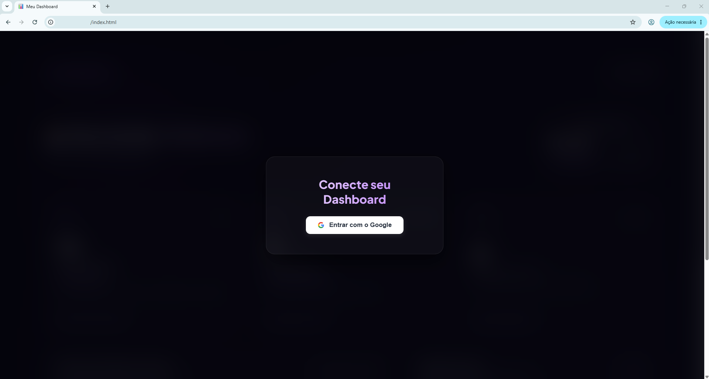
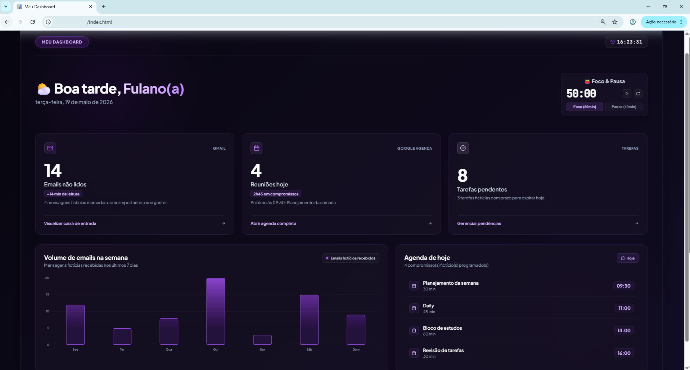

# 📊 Dashboard Mockado

Dashboard desenvolvido através da modalidade 'vibecoding', que consiste em codar ouvindo música e se divertindo.
O dashboard é moderno, responsivo e desenvolvido com HTML, CSS e JavaScript puro, utilizando dados 100% fictícios/mockados para fins de estudo, portfólio e demonstração visual.


---

# ✨ Funcionalidades

- ✅ Dashboard moderno em estilo glassmorphism
- ✅ Login fictício/simulado
- ✅ Relógio em tempo real
- ✅ Saudação dinâmica, conforme horário local (Bom dia / Boa tarde / Boa noite)
- ✅ Data atual formatada em português
- ✅ Timer Pomodoro funcional
- ✅ Cards informativos mockados
- ✅ Agenda fictícia dinâmica
- ✅ Gráfico interativo com Chart.js
- ✅ Layout responsivo
- ✅ Estrutura organizada em HTML + CSS + JS

---

# 🔒 Segurança

Este projeto NÃO utiliza:

- OAuth real
- APIs Google
- Tokens
- Client Secret
- Armazenamento em localStorage
- Integração com Gmail ou Google Agenda

Todos os dados exibidos são totalmente fictícios/mockados.

---

# 🛠️ Tecnologias Utilizadas

## Front-end

- HTML5
- CSS3
- JavaScript (ES6+)

## Bibliotecas

- Chart.js (via CDN)

## Estilo Visual

- Glassmorphism
- Gradientes
- Efeitos glow
- Responsividade

---

# 📁 Estrutura do Projeto

```txt
projeto/
│
├── index.html
├── style.css
├── responsive.css
├── script.js
└── README.md
```

---

## 📸 Preview do Projeto




---

# 🚀 Como rodar o projeto

1. Clone o repositório (git clone https://github.com/barbieribbruna/vibecoding_dashboard.git)
2. Abra o arquivo index.html no navegador ou utilize a extensão Live Server do VS Code.

---

# 📌 Observações

- O botão “Entrar com Google” é apenas visual/simulado.
- Nenhuma autenticação real é realizada.
- O dashboard foi projetado para fins educacionais e de portfólio.

---

# 🚀 Melhorias Futuras

- Dark/Light Mode
- Persistência local de tarefas
- Configuração de temas
- Exportação de relatórios
- Integração futura com backend mockado

---

# 👩‍💻 Autora

Desenvolvido por Bruna Barbieri para fins de estudo, prática e portfólio.

[GitHub](https://github.com/barbieribbruna)  
[LinkedIn](https://www.linkedin.com/in/barbieribbruna/)

